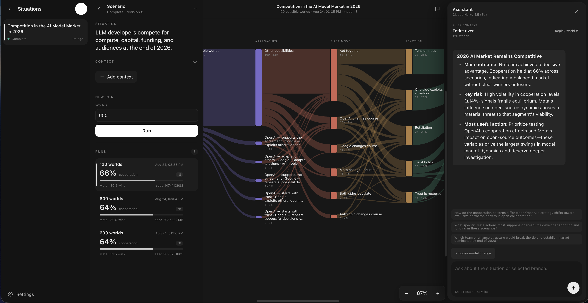

# Flumina

> **Map the currents. Choose your course.**



Flumina is a local decision laboratory that combines a game-theory
engine, an event-sourced TEOB workflow, and an AI agent built on headless Pi. It
turns an ordinary description of a recurring conflict or partnership into hundreds
or thousands of reproducible possible futures.

Instead of producing one confident prediction, the application shows which outcomes
remain plausible, which strategies perform well across them, and which assumption
changes the conclusion. It helps answer three practical questions:

- who tends to come out ahead across plausible versions of the situation;
- whether cooperation survives, oscillates, or collapses;
- which assumption changes the conclusion and is therefore worth checking first.

The river metaphor is functional: assumptions create currents, actions split them
into branches, and repeated simulations reveal the courses that remain viable.
Flumina maps those possible futures so that a decision-maker can choose a strategy
without mistaking one plausible outcome for a prediction.

An AI model translates the situation into explicit assumptions and a validated
scenario model. A deterministic TypeScript engine then explores the uncertainty
space at speed; the outcomes are calculated by the simulation, not invented by the
AI.

The three parts have distinct responsibilities:

- **[Game theory](https://en.wikipedia.org/wiki/Game_theory)** supplies the repeated-game model, strategies, payoffs, reputation,
  punishment, coalitions, and other interaction mechanisms.
- **[TEOB](https://github.com/lambda-house/teob-ts)** supplies the experiment lifecycle: commands, immutable events, revision
  checks, durable history, recovery after restart, and projections for current
  views. It makes runs traceable and resumable rather than making the math loop fast.
- **[Pi](https://github.com/earendil-works/pi)** supplies the modeling agent: it turns prose into explicit assumptions,
  builds a typed model, optionally researches missing facts, and labels the resulting
  branches in human terms.

New to repeated games? Veritasium's
[This game theory problem will change the way you see the world](https://www.youtube.com/watch?v=mScpHTIi-kM)
is an accessible introduction to the Prisoner's Dilemma, repeated interaction, and
why successful strategies often combine cooperation, retaliation, and forgiveness.

## What the application does

A scenario is **one context**, **one editable model**, and **one Run button**.

1. **Describe a situation.** Start with a rivalry, alliance, price war, standoff,
   shared resource, or another relationship in which 2–10 sides meet repeatedly. What
   you write becomes the first fact.
2. **Let the agent fill in the rest.** It researches materially useful public facts,
   shows the sources it used, keeps uncertain values broad, and raises only what cannot
   be verified publicly as optional questions. Questions never block anything: answer
   one to replace the assumption or ignore it to keep the default.
3. **Review the model.** Situation details live in the editable model. Separately, tell
   the agent what actually happened after a run; those outcome facts reweight the river
   without being baked back into its assumptions.
4. **Press Run.** One action validates the current model against the engine's domain
   rules and explores 1–5000 worlds (default 600). Editing context or outcome evidence
   never triggers a run by itself.
5. **Explore the result.** An interactive river groups worlds by approach, opening,
   response, development, and outcome. Select a branch to inspect it or replay a
   representative pair round by round.
6. **Say what actually happened.** An outcome fact reweights the finished run instantly
   — no re-run — to the worlds consistent with it, and reports how many still match.
   Outcome facts never enter the model, so the analysis stays a forecast rather than a
   restatement of the answer.
7. **Compare runs.** Every run keeps the facts fingerprint it was computed from, its
   seed, metrics, visual report, and replay artifact. New situation facts mark older
   runs stale without erasing them.

The application also includes provider/model selection, reasoning-level controls, a
read-only view of the model built from your facts, cancellable background analysis,
live updates, and undoable deletion.

## Quick start

Requirements: Node.js **22.19+** and pnpm.

```bash
pnpm install
pnpm app
```

Open <http://127.0.0.1:4317>. The server only listens on the local loopback
interface.

`pnpm app` type-checks and builds the React application before starting the API.
The first launch creates `data/app.db`; completed runs create HTML and JSON
artifacts under `reports/tasks/`.

### Configure an AI provider

Open **Settings → Model and access** in the application, add a provider API key,
and choose the default provider, model, and reasoning level. Existing Pi
authentication is also discovered automatically (normally from
`~/.pi/agent/auth.json`), as are provider credentials supplied through their
standard environment variables.

These optional variables control the defaults and local server:

| Variable | Purpose | Default |
|---|---|---|
| `PI_PROVIDER` | Default Pi provider ID | first authenticated provider |
| `PI_MODEL` | Default model ID | first available fallback/model |
| `PI_THINKING_LEVEL` | Default reasoning level | model-dependent |
| `PORT` | HTTP port | `4317` |
| `APP_DB_PATH` | SQLite journal path | `data/app.db` |
| `ANALYSIS_TIMEOUT_MS` | Simulation-worker timeout | `300000` |

The web workflow needs an authenticated AI model to understand a situation, build
the model, and label the river. The simulation engine and CLI do not need an API
key once a JSON model exists.

## Development

Run the API and Vite development server in separate terminals:

```bash
pnpm app:server
pnpm app:dev
```

Open the Vite URL, normally <http://127.0.0.1:5173>. Vite proxies `/api` and
`/reports` to the API at port `4317`.

Useful commands:

| Command | What it does |
|---|---|
| `pnpm build` | Type-checks the engine and frontend, then builds the app |
| `pnpm test` | Runs the self-check and model/engine verification pack |
| `pnpm app` | Builds and starts the local application |
| `pnpm app:server` | Starts the API in watch mode |
| `pnpm app:dev` | Starts the Vite frontend dev server |
| `pnpm bench:engine` | Runs scenario-level engine benchmarks |
| `pnpm bench:live` | Runs move-level benchmarks against datasets in `data/raw/` |
| `pnpm bench:all` | Runs both benchmark layers and cross-validation |

## How it is built

```text
React + TanStack Router/Query
              │ HTTP + SSE
              ▼
Node HTTP server ── Task aggregate ── SQLite event journal
       │                    │
       │                    └── projections rebuild task lists and detail views
       │
       ├── Pi model runtime ── typed output contracts ── domain validation
       │
       └── worker thread ── deterministic Monte Carlo engine
                              ├── summary metrics
                              ├── interactive HTML river
                              └── JSON replay artifact
```

### Frontend

`app/` is a React 19 single-page application built with Vite. TanStack Router keeps
the selected task and run addressable in the URL; TanStack Query owns server state.
Server-sent events refresh an active task while analysis or AI labeling is running.
The result river is an embedded, self-contained HTML report that communicates the
selected worlds back to the workspace.

### Backend and persistence

`src/app-server.ts` serves the built frontend, the JSON API, reports, and SSE. Task
state is modeled as a TEOB aggregate: commands decide immutable events, SQLite is
the source of truth, and in-memory projections provide the read side. Optimistic
revision checks prevent an old browser state from overwriting newer edits.

Simulation runs execute in a worker thread so the HTTP server stays responsive.
The same seed and model reproduce the same worlds. Interrupted `running` or
`labeling` tasks are resumed when the server starts again.

The embedded Pi agent does not spawn Claude CLI. Its structured operations expose
only one terminating TypeBox output tool and disable built-in filesystem, shell,
editing, extensions, skills, prompt templates, and project-context tools. User text
and research excerpts are treated as untrusted data. Public research uses a bounded
search plan, validates every public HTTP target, limits response sizes and redirects,
and supplies only cleaned excerpts to the modelling prompt. The agent never receives
filesystem, shell, or unrestricted browser access.

## Simulation model

Each pair repeatedly chooses **C** (cooperate) or **D** (defect). Per-round payoffs
use the conventional values:

- `R`: both cooperate;
- `T`: one defects while the other cooperates;
- `P`: both defect;
- `S`: one cooperates while the other defects.

The ordering defines the game:

| Game | Ordering | Typical interpretation |
|---|---|---|
| Prisoner's Dilemma | `T > R > P > S`, with `2R > T + S` | cooperation is valuable but unilateral defection tempts |
| Chicken / Snowdrift | `T > R > S > P` | mutual escalation is the worst outcome |
| Stag Hunt | `R > T > P > S` | coordination and confidence are the main problem |

Every scenario uses ranges rather than one supposedly exact estimate. A world
samples fresh values, plays all pairs round-robin, normalizes asymmetric payoff
scales, and records winners, cooperation, inputs, scores, and a behavioral digest.
The geometric horizon is controlled by `w` and capped at 10,000 rounds per match.

### Supported mechanisms

- 2–10 participants and 24 built-in dispositions;
- shared or player-specific payoff ranges;
- fixed teams, collusion, and optional intra-team betrayal;
- player lean (`values`), behavioral drift, and observation noise;
- custom memory-n cooperation tables;
- voluntary exit with an outside payoff (`sigma` + `loner`);
- indirect reciprocity with Leading Eight reputation norms, gossip, or a numeric
  reputation ledger (3+ participants);
- peer or pool punishment with explicit cost and penalty;
- pre-play cheap talk with credibility and lying cost;
- continuous eco-feedback or discrete outcome-driven game transitions;
- deterministic seeds, winner/cooperation sensitivity, posterior reweighting, and
  exact replay of any sampled world.

For the included compatibility model, see [GAME_THEORY.md](GAME_THEORY.md).
For the event-sourced design, see
[PROJECT_ARCHITECTURE.md](PROJECT_ARCHITECTURE.md). Benchmark datasets, provenance,
and reproduction notes are in [data/README.md](data/README.md).

## Validation and benchmarks

Benchmarks belong in the project because a strategy simulator should demonstrate
that it can recover known signals and reveal where its model does not fit. Frozen
scores do not belong in the main README: they become stale as the engine and data
change. The repository therefore keeps the benchmark method and reproduction path
here, while every run prints its current results.

The suite covers synthetic holdouts, repeated-game laboratory data (DF2011 and
dilemmaRL), and historical conflict/sanctions proxies (MID and TIES). It compares
the engine with simple zero, historical-mean, and coin baselines; the move-level
suite separately checks predictive behavior under strategy and noise.

```bash
pnpm bench:engine   # scenario-level calibration and baseline comparison
pnpm bench:live     # move-level datasets
pnpm bench:all      # both layers plus cross-validation
```

These checks validate implementation and calibration; they do not prove that an
unobserved real-world situation will follow the model. Dataset sources, hashes, and
known gaps are documented in [data/README.md](data/README.md).

### What the benchmarks say about prediction

Flumina is a conditional scenario forecaster. Its output is a distribution over
possible worlds, together with the assumptions that move that distribution. The
benchmarks support a modest standalone signal and a stronger case for updating a
broad prior when partial observations are available.

The current benchmark runs show:

| Test | Result | Interpretation |
|---|---:|---|
| Synthetic winner holdout | 60.0% vs 50% coin | A modest signal in a one-trial-per-model test |
| DF2011 cooperation rate | mean agreement 89.4% | MAE 10.6 percentage points across six treatments |
| dilemmaRL cooperation rate | mean agreement 94.6% | MAE 5.4 percentage points across five non-zero-delta groups |
| ABC partial observation | MAE 0.054 vs prior 0.293 | Conditioning selects worlds close to 40 observed rounds |
| Hidden-strategy recovery | 20% top-1 vs 13% chance | Partial player-level outcomes contain information about latent dispositions |

The treatment-level figures are agreement scores, calculated as
`100 − absolute error in the observed cooperation rate`. They are not binary
classification accuracy. The DF2011 and dilemmaRL mappings use treatment variables
to set behavioral ranges, so these results measure calibration and model fit. They
are not independent forecasts of previously unseen treatments.

The move-level results require the same caution. Predicting the previous move again
with a Tit-for-Tat-style rule reaches 82–91% on several datasets, but this mostly
measures behavioral persistence. It is a useful baseline and implementation check,
not the predictive accuracy of the full scenario engine. Class-imbalance metrics
such as balanced accuracy, macro-F1, and transition accuracy are needed alongside
raw accuracy.

The ABC experiment gives the clearest picture of the product's intended use. A broad
prior over repeated-game worlds has cooperation-rate MAE 0.293. Reweighting those
worlds after observing 40 rounds reduces MAE to 0.054, while copying the short
sample directly gives 0.046. The current result therefore supports posterior
narrowing and hidden-state inference; it does not show that the model beats a raw
sample estimate for the same quantity. The target rate includes the observed rounds,
so this test should be read as partial-observation validation rather than a fully
independent holdout.

MID and TIES use simplified repeated-game proxies. Their results indicate how far a
generic model can reproduce aggregate cooperation rates under those proxies. They
do not validate forecasts of real conflicts or sanctions. The forecast remains
conditional on the facts, payoff ranges, behavioral assumptions, and game class
provided by the user.

## Command-line use

Run an existing model without the web application:

```bash
pnpm scenario example_model.json 600 --seed 42
```

The second positional argument is the number of worlds; it defaults to `600`.
The default seed is `42`.

```bash
pnpm scenario example_model.json 600 --visual      # reports/visual.html
```

Example models cover Prisoner's Dilemma, Chicken, Stag Hunt, teams, drift,
eco-feedback, state transitions, voluntary exit, punishment, and cheap talk. Copy
the closest file, change the situation and ranges, then run it with a fixed seed.

## Repository map

| Path | Responsibility |
|---|---|
| `app/` | React workspace, API client, routing, and visual design contract |
| `src/app-server.ts` | Local HTTP API, static files, SSE, jobs, and report lifecycle |
| `src/task.ts` | Event-sourced task aggregate and revision rules |
| `src/pi-agent.ts` | Headless Pi runtime, model discovery/auth, and typed agent runs |
| `src/scenario-agent.ts` | Situation understanding, model construction, and river labels |
| `src/domain.ts` | Scenario types and domain validation |
| `src/kernel.ts` | Repeated-game strategies and match mechanics |
| `src/monte-carlo.ts` | Game-agnostic deterministic worlds, summaries, and conditioning |
| `src/topology.ts` | Game-agnostic nodes, interactions, and uncertain topology sampling |
| `src/analysis.ts` | C/D compatibility model implemented on the generic core |
| `src/worlds-report.ts` | Interactive river report generation |
| `src/cli.ts` | Standalone command-line entry point |
| `data/` | SQLite app state plus benchmark manifest and raw datasets |
| `reports/tasks/` | Generated run visualizations and replay artifacts |
| `example_*.json` | Ready-to-run scenario models |
## Limits

- The Monte Carlo and topology core is game-agnostic. The included compatibility
  model implements repeated, simultaneous 2×2 games; other games plug in as new
  simulation callbacks and are intentionally not implemented yet.
- Teams are fixed during a run; there is no endogenous coalition formation.
- AI helps formulate and label the model, but simulated participants follow explicit
  strategies; they are not autonomous LLM agents.
- Results are conditional on the supplied ranges and assumptions. They are scenario
  analysis, not a factual forecast or a substitute for domain evidence.
